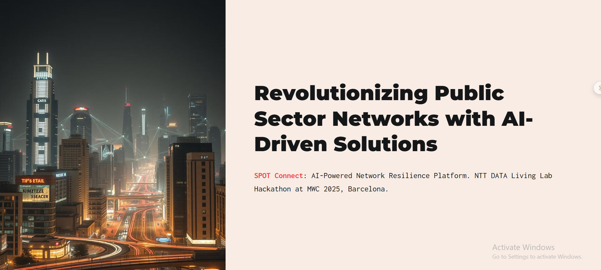
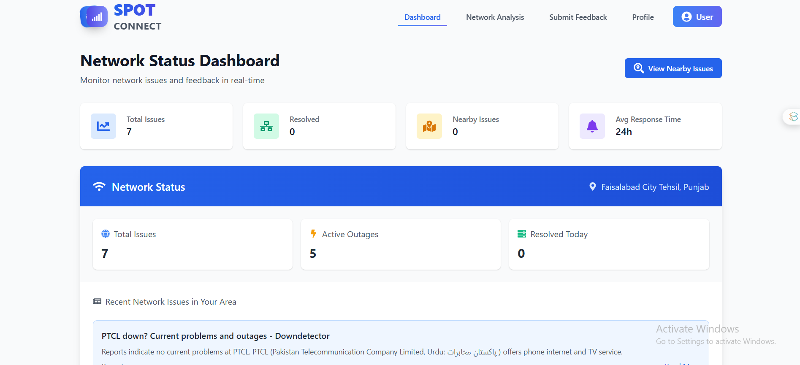

# SPOT CONNECT

### [[Submission Link](https://lablab.ai/event/ai-for-connectivity-hackathon-building-resilient-networks/default/spot-connect)]


---



---

## Problem Statement + Solution:
𝗦𝗣𝗢𝗧 𝗖𝗼𝗻𝗻𝗲𝗰𝘁 is an AI-powered network resilience platform that revolutionizes 𝗽𝘂𝗯𝗹𝗶𝗰 𝘀𝗲𝗰𝘁𝗼𝗿 infrastructure by harnessing cutting-edge AI solutions to drive predictive maintenance, real-time monitoring, and intelligent routing. Our platform addresses critical 𝗰𝗵𝗮𝗹𝗹𝗲𝗻𝗴𝗲𝘀 such as reactive maintenance, inefficient resource allocation, high operational costs, and suboptimal routing, ensuring networks remain robust, reliable, and efficient. Utilizing hyperdimensional computing and advanced time-series analysis, SPOT Connect anticipates faults before they occur, optimizes maintenance schedules, and manages energy and costs through dynamic routing algorithms and QoS-aware optimization. The secure architecture, built on a FastAPI framework and Python ML stack, guarantees real-time data processing and robust security. Future enhancements include advanced ML model integration, IoT sensor expansion, GIS data incorporation, and cloud-native deployment, positioning SPOT Connect as the cornerstone of digital transformation in the public sector.


## Here is the preview:


---



---


---

## Getting Started

### Prerequisites

- **Node.js** (for frontend development)
- **Python 3.8+** (for backend)
- **poetry** (to install the  Python dependencies)

### Installation

1. **Clone the repository:**
   ```bash
   https://github.com/HassanMehmood413/SPOT-CONNECT.git
   cd backend
   ```

2. **Set up the backend:**
   ```bash
   poetry install
   ```

3. **Set up the frontend:**
   ```bash
   cd ../Frontend
   npm install
   ```

4. **Run the application:**
   - **Backend:** Start the FastAPI server:
     ```bash
     poetry run uvicorn app.main:app --reload
     ```
---

